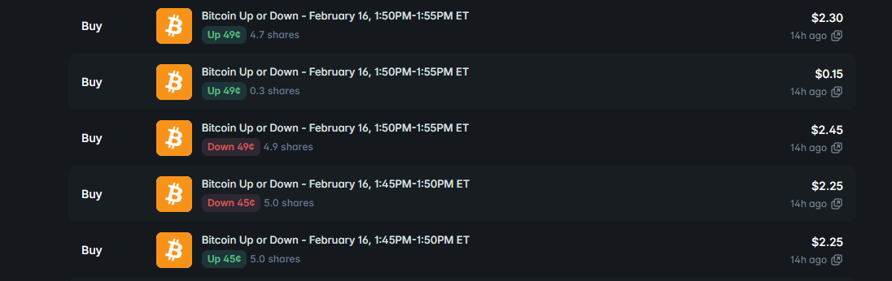

# 5-Minute BTC Polymarket Trading Bot

**Rust trading bot for Polymarket prediction markets.** Automates hedging and position management on **BTC 5-minute** binary (Up/Down) markets. Lock profit when cost per pair is favorable; expand positions when the opposite side is rising and PnL is skewed.

[](https://www.rust-lang.org/)
[](https://polymarket.com)

**Repository:** [github.com/gabagool23/5min-btc-polymarket-trading-bot](https://github.com/gabagool23/5min-btc-polymarket-trading-bot)

---

## How we profit

We buy **Up** and **Down** so that **cost per pair (Up + Down) &lt; $1**. Whichever side wins pays out $1 per share, so we lock in profit regardless of outcome. The bot only adds a side when the resulting average cost per pair stays under your cap (e.g. 0.99).

---

## Test result

Below is a test run of the 5-minute bot: we buy Up and Down with combined cost &lt; 1 and realize profit when the market resolves.



---

## Features

- **5-minute BTC only:** Trades **5m** binary Up/Down markets for **BTC** on [Polymarket](https://polymarket.com).
- **Lock rule:** Buys the opposite side only when **cost per pair** stays under your cap (e.g. Up_avg + Down_ask ≤ 0.99), so you lock in edge.
- **Expansion rule:** When you can’t lock (cost would exceed max) but the other side is **rising** and its outcome PnL is worse, the bot buys that side to improve exposure (see [logic.md](logic.md)).
- **Ride the winner:** When one side is clearly winning (trend UpRising/DownRising), the bot adds to that side to grow “PnL if that side wins.”
- **PnL rebalance:** If one outcome’s PnL is negative and you’re not strongly trending the other way, it buys the weak side (within cost limits).
- **Flat = no trade:** When the short-term trend is **Flat** (no clear move), the bot only locks if conditions allow; otherwise it does not open new risk (Example 6 in [logic.md](logic.md)).
- **Simulation mode:** Run with `--simulation` (default) to log trades without sending orders.
- **Market resolution:** Checks for closed markets, computes actual PnL, and logs “Total actual PnL (all time).”
- **Timestamped logs:** Price feed and history lines include `[YYYY-MM-DDTHH:MM:SS]` for easier debugging and backtesting.

---

## Strategy Overview

The bot keeps **positions** per market (Up shares, Down shares, average prices). Each tick it:

1. Updates **trend** from the last 4–5 price points (UpRising, DownRising, Flat, UpFalling, DownFalling).
2. **Lock:** If adding the underweight side keeps cost per pair ≤ `cost_per_pair_max` → buy that side (lock).
3. **Expansion:** If you *can’t* lock (cost would exceed max) but the other side is **rising** and “PnL if that side wins” is worse → buy that side (new leg / rebalance).
4. **Ride winner:** If trend is UpRising or DownRising (and not Flat) → buy the rising side (within cost and buy limits).
5. **PnL rebalance:** If one outcome’s PnL is negative and trend isn’t strongly the other way → buy the weak side (within limits).
6. **Trend fallback:** DownFalling → can buy Up; UpFalling → can buy Down (no buy on Flat except lock).

Detailed examples (no position, only Up, only Down, have both, Flat, market close) are in **[logic.md](logic.md)**.

---

## Requirements

- **Rust** 1.70+ (`rustc --version`)
- **Polymarket API** credentials (API key, secret, passphrase, and optionally private key / proxy wallet for live trading)

---

## Installation

```bash
git clone https://github.com/baker42757/5min-btc-polymarket-trading-bot.git
cd 5min-btc-polymarket-trading-bot
cargo build --release
```

---

## Configuration

Copy the example config and edit with your settings:

```bash
cp config.example.json config.json
# Edit config.json with your Polymarket API keys and trading parameters
```

**Important:** `config.json` is gitignored. Do not commit real API keys.

### Trading options (in `config.json` → `trading`)

| Option | Description | Example |
|--------|-------------|---------|
| `markets` | Assets to trade (this bot: BTC only) | `["btc"]` |
| `timeframes` | Periods (this bot: 5m only) | `["5m"]` |
| `cost_per_pair_max` | Max cost per pair when locking | `0.99` |
| `min_side_price` | Don’t buy below this ask | `0.05` |
| `max_side_price` | Don’t buy above this ask | `0.99` |
| `cooldown_seconds` | Min seconds between buys | `0` |
| `cooldown_seconds_1h` | Min seconds between buys (1h; N/A for 5m-only) | `45` |
| `shares` | Override size per order; `null` = default (BTC 5m=24) | `null` |
| `size_reduce_after_secs` | Start reducing size in last N seconds | `300` |
| `market_closure_check_interval_seconds` | How often to check for resolved markets | `20` |

---

## Usage

**Simulation (no real orders):**

```bash
cargo run -- --simulation
# or
cargo run --release -- --simulation
```

**Live trading (sends FAK orders to Polymarket):**

```bash
cargo run --release -- --production --config config.json
```

**Redeem winnings for a resolved market:**

```bash
cargo run --release -- --redeem --condition-id <CONDITION_ID>
```

Logs go to `history.toml` (and your configured log target). Price lines look like:

```text
[2026-02-04T23:17:23] BTC 5m Up Token BID:$0.52 ASK:$0.53 Down Token BID:$0.47 ASK:$0.48 remaining time:4m 12s
```

---

## Project structure

```text
.
├── Cargo.toml
├── config.json          # Your config (gitignored); use config.example.json as template
├── logic.md             # Strategy examples (lock, expansion, ride winner, flat)
├── history.toml         # Append-only trade/price log (gitignored in default .gitignore)
├── docs/
│   └── TARGET_STRATEGY_ANALYSIS.md
├── src/
│   ├── main.rs          # CLI, config load, monitor + trader spawn
│   ├── config.rs        # Config and defaults
│   ├── api.rs           # Polymarket Gamma + CLOB API
│   ├── monitor.rs       # Price feed, snapshot, timestamps
│   ├── trader.rs        # Lock/expansion/ride-winner/PnL logic
│   ├── models.rs        # API and market data types
│   └── bin/
│       └── analyze_target_history.rs  # Analyze btc-5m.toml history
└── README.md
```

---

## Disclaimer

This bot is for **educational and research purposes**. Trading prediction markets involves risk. Past behavior in simulation or backtests does not guarantee future results. Use at your own risk. The authors are not responsible for any financial loss.

---

## Contact

Telegram: [@gabagool21](https://t.me/gabagool21)

<div align="left">
  <a href="https://t.me/gabagool21">
    
  </a>
</div>

---

## Keywords (for search)

Polymarket trading bot, Polymarket bot, Polymarket automation, crypto prediction market bot, BTC prediction market, Polymarket CLOB, Polymarket API, prediction market hedging, binary market bot, Rust Polymarket, Polymarket 5m, Polymarket arbitrage, Polymarket hedging bot, 5-minute BTC.
